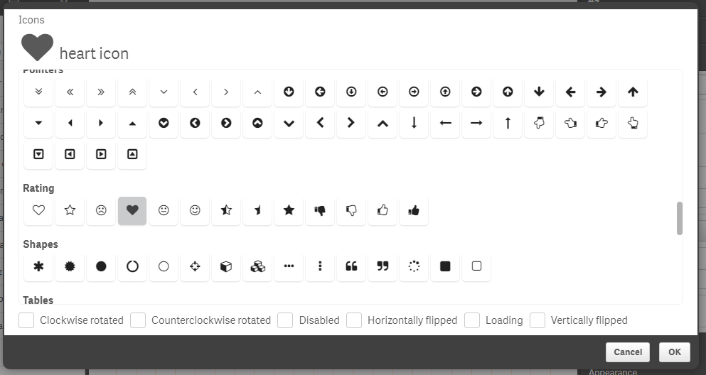
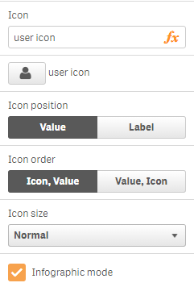
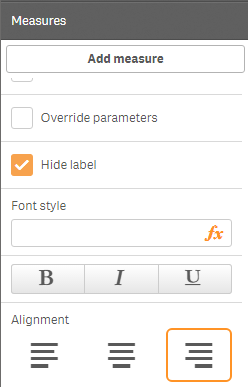
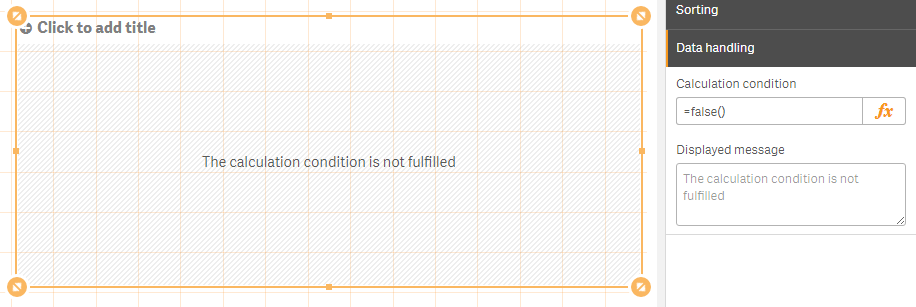
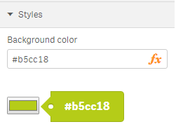
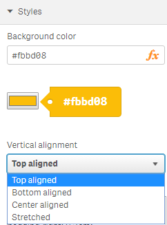
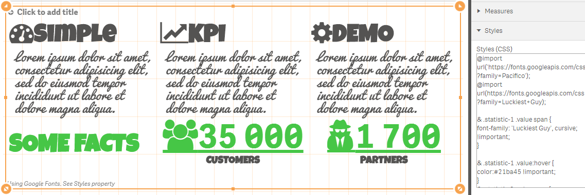

# Simple KPI


Simple KPI component for Qlik Sense.
It can show one or several KPI using measures and one dimension (selectable, optional, it can show up to 125 measures and if it is used no more then 80 dimensions lines).
Supports adaptive design, conditional css colors, conditional icons, infographic (with constraints, no more than 1000 icons per measure), configurable number of kpis per line, several predefined sizes, custom styles (CSS).
Each measure can have a link to another sheet.

[](https://circleci.com/gh/qlik-oss/qsSimpleKPI/tree/master)

## Introduction Video

[](https://youtu.be/vubli1Icp68)

## Developing the extension

If you want to do code changes to the extension follow these simple steps to get going.

1. Get Qlik Sense Desktop
1. Create a new app and add qsSimpleKPI to a sheet.
2. Clone the repository
3. Run `npm install`
4. Change the `deployFolder`in `server.config.json` to be your local extensions folder. It will be something like `C:/Users/nerush/Documents/Qlik/Sense/Extensions/qlik-multi-kpi`.
5. Run `npm run dev`. This will start a watcher which will rebuild the extension and output all needed files to the `deployFolder` for each code change you make.
6. See your changes directly in your Qlik Sense app.

## Installation

1. Download the extension zip, `qlik-multi-kpi.zip`, from the latest release(https://github.com/qlik-oss/qsSimpleKPI/releases/latest)
2. Install the extension:

   a. **Qlik Sense Desktop**: unzip to a directory under [My Documents]/Qlik/Sense/Extensions.

   b. **Qlik Sense Server**: import the zip file in the QMC.

## Configuration

**Icon for value or label**




**Conditional colours**


**Conditional icons**


**Infographic mode**

You can set "Infographic mode" option for each measure. In such case expression determines icons quantity (with constraints, no more than 1000 icons per measure).



**Measure alignment**



**Calculation condition**



**Styles**

 "Background color" property allows to set background color of the object using expression.

 

 All KPIs can be vertically aligned.

 

 You can fully customize kpis using "Styles (CSS)" property. For more details see [SimpleKPIDemo.qvf](resources/SimpleKPIDemo.qvf) ("Styles" sheet).



 For example, you can change font-family, font-size, background color, text color and so on, using "Styles (CSS)" property for appropriate measure.

 ```
@import url('https://fonts.googleapis.com/css?family=Indie Flower');
@import url('https://fonts.googleapis.com/css?family=Fredoka One');

& .label * {
  font-family: 'Fredoka One';
  font-size:  300%;
}

& .statistic-1  .value * {
  background-color: green;
  font-family: 'Indie Flower', sans-serif;
  color: white !important;
}

& .value * {
  background-color: yellow;
  font-family: 'Indie Flower', sans-serif;
  font-size: 900%;
  color: red !important;
}
 ```

For example, you can import "Font Awesome" and use it. Just copy and paste the following styles into "Styles (CSS)" property.
```
@import url('https://maxcdn.bootstrapcdn.com/font-awesome/4.5.0/css/font-awesome.min.css');
```

Just copy and paste appropriate classes ([see icons](https://fortawesome.github.io/Font-Awesome/icons/)) into the "Icon" measure's property.
For example, copy and paste the following into the "Icon" property.
```
fa fa-calendar
```


## Data limits
Measurements: 1-256
Dimensions: 0-1

## Demo Application

Download [SimpleKPIDemo.qvf](resources/SimpleKPIDemo.qvf)

## Tutorial Video

[](https://youtu.be/gJxUUnJi5Vc)

## Original Author
[alner](https://github.com/alner)
