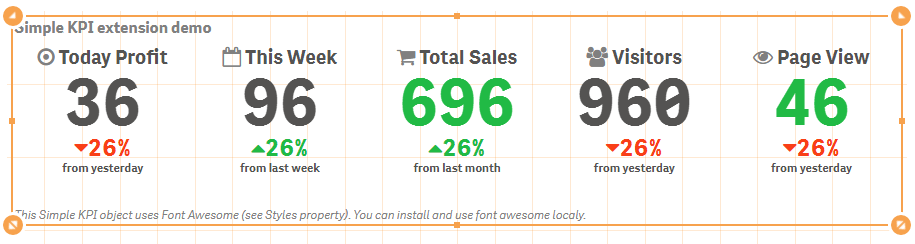
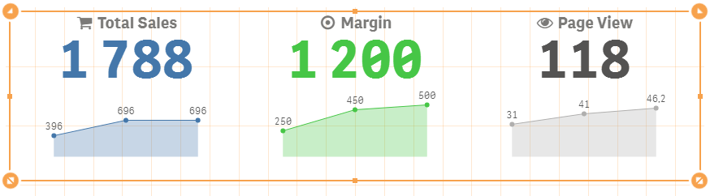
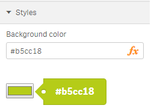
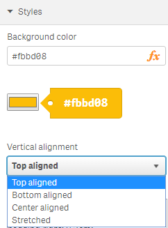
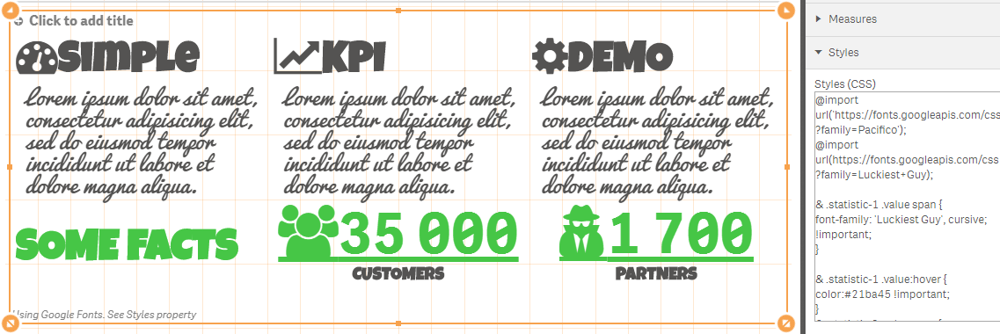

# Simple KPI

Simple KPI component for Qlik Sense.
It can show one or several KPI using measures and one dimension (selectable, optional, it can show up to 100 measures and if it is used no more then 100 dimensions lines).
Supports adaptive design, conditional css colors, conditional icons, infographic (with constraints, no more than 1000 icons per measure), configurable number of kpis per line, several predefined sizes, custom styles (CSS).
Each measure can have a link to another sheet.


## Installation

Download [build/qsSimpleKPI.zip](https://github.com/alner/qsSimpleKPI/raw/master/build/qsSimpleKPI.zip), upload to qlik server or extract to appropriate folder.

Qlik Sense Desktop: unzip to a directory under [My Documents]/Qlik/Sense/Extensions.

Qlik Sense Server: import the zip file in the QMC.

## Demo

Download [SimpleKPIDemo.qvf](examples/SimpleKPIDemo.qvf)


You can easily add several kpis, group them accordingly and apply different ui settings (different font sizes, alignments, styles, icons, links to different sheets, responsive options).



You can embedded Master Visualizations into the simple kpi object.



You can add measure with some fake value (for example, using the following expression: ='Drag and Drop here'), then drag and drop master visualization into the value region or you can insert object id into the "Visualization" property for each measure.


Infographic mode allows you to show appropriate number of icons (depends on measure, with constraints, no more than 1000 icons per measure).


## Configuration


You can set icon for value or label (full icons set included).


**Conditional colors**


**Conditional icons**


**Infographic mode**

You can set "Infographic mode" option for each measure. In such case expression determines icons quantity (with constraints, no more than 1000 icons per measure).


**Measure alignment**


**Calculation condition**


**Styles**

 "Background color" property allows to set background color of the object using expression.

 

 All KPIs can be vertically aligned.

 

 You can fully customize kpis using "Styles (CSS)" property. For more details see [SimpleKPIDemo.qvf](examples/SimpleKPIDemo.qvf) ("Styles" sheet).



 For example, you can change font-family, font-size, background color, text color and so on, using "Styles (CSS)" property for appropriate measure.

 ```
@import url('https://fonts.googleapis.com/css?family=Indie Flower');
@import url('https://fonts.googleapis.com/css?family=Fredoka One');

& .label * {
  font-family: 'Fredoka One';
  font-size:  300%;
}

& .statistic-1  .value * {
  background-color: green;
  font-family: 'Indie Flower', sans-serif;
  color: white !important;
}

& .value * {
  background-color: yellow;
  font-family: 'Indie Flower', sans-serif;
  font-size: 900%;
  color: red !important;
}
 ```

For example, you can import "Font Awesome" and use it. Just copy and paste the following styles into "Styles (CSS)" property.
```
@import url('https://maxcdn.bootstrapcdn.com/font-awesome/4.5.0/css/font-awesome.min.css');
```

Just copy and paste appropriate classes ([see icons](https://fortawesome.github.io/Font-Awesome/icons/)) into the "Icon" measure's property.
For example, copy and paste the following into the "Icon" property.
```
fa fa-calendar
```


## Maintainers

[alner](https://github.com/alner)

## License

MIT
