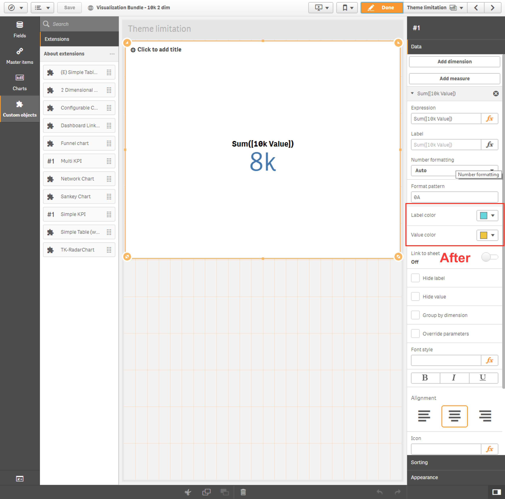

# Limitations
There is a known limitation with automatic color changes when changing app theme.

**Expected**: The expected behaviour is for the colors in the extension to automatically be updated to the default colors of a theme when changing between themes.

**Actual**: The colors will change in the property panel, but the changes are not reflected in the extension object.

## Example

**With classic theme**

**After changing to breeze theme**
